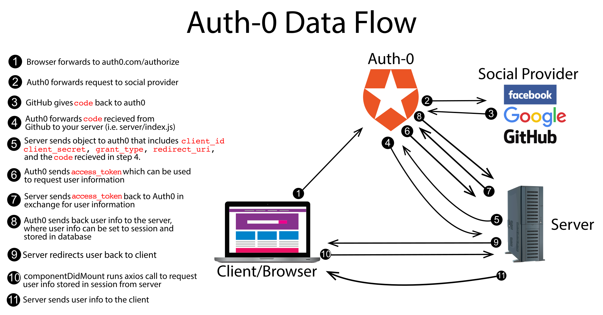

# Project Summary

In this project, we'll use a service called Auth0 to do the heavy lifting of auth for us, including allowing for social integrations (github, google, etc).

## Setup

* `Fork` and `clone` this repository.
* `cd` into the project directory.
* Run `yarn`. You know to use yarn instead of npm because there is a `yarn.lock` file.
* Create a Postgres database. Use this project's `db/init.sql` file to create the schema.
* Copy the `.env.example` file to a new file called `.env` and paste in the connection string to the postgres database.
  * While you're there, fill out some random value for the SESSION_SECRET value.
  * We'll fill out the other values in the `.env` file later.
* Start the server with `nodemon`.
* Start the web dev server with `npm start`. In your browser, open `http://localhost:3000`.
* Look at the app's code to get a feel for it.

## Step 1

### Summary

In this step, we'll go to `manage.auth0.com` to create an account. We'll create an 'application' that represents this particular app. We'll enable social connections.

### Instructions

* Go to `manage.auth0.com`.
* Register for an account.
  * For a tenant name, choose something professional-ish like your name or company name, e.g. `tylercollier` or `mycompanyname`. This will end up giving you a domain like mycompanyname.auth0.com.
  * Set the account type to `Personal`.
  * Set the role to `Developer`.
  * Set the project to `Just playing around`.
* Log in to your Auth0 account.
* Go to `Applications` using the left navigation bar.
* Click the `Create Application` button in the top right.
  * Pick a name (recommendation: `auth0-mini`)
  * Change the `Application Type` to `Single Page Web Applications`.
  * Click Create.
  * Switch to the application's `Settings` tab.
  * Change the `Allowed Callback URLs` to `http://localhost:3000/auth/callback`.
* At the bottom, click `Save Changes`.
* Back at the top of the settings, copy the domain, client ID, and client secret to your project's `.env` file. Be sure to restart your React web dev server to use these values. Nodemon should automatically restart your Node/Express server.
* On the Auth0 website, click on Connections on the left hand side navigation, and then Social.
  * Enable the Github connection.
  * Then click the Github connection to configure it. In the Attributes section, check Email address. Leave the Client ID and Client Secret sections blank, such that you'll be using Auth0's dev keys. Click Save.
  * Enable further social connections as desired.

### Data flow

Here's a diagram of the flow of information that we'll be using in this project:



## Step 2

### Summary

In this step, we'll check if the user is logged in, and we'll forward the user to the hosted Auth0 login page.

### Instructions

* Open the `src/App.js` file.
* Add a `componentDidMount()` prototype method:
  * Make an axios GET request to `/api/user-data`. Use the response data to set the React user state.
    * If the response data does not contain a `user` key, set the React user state to `null`. By setting the state to `null` instead of `undefined`, the displayed user state will show as the word "null" instead of blank.
* Add a `login()` prototype method:
  * Set `window.location` equal to a URL that has the following parts:
    * Scheme: https
    * Host: Your Auth0 domain you set in your `.env` file
    * Path: `/authorize`
    * A query string parameter named `client_id` with a value of the client ID in your `.env` file
    * A query string parameter named `scope` with a value of `openid profile email`, but each space must be replaced with `%20`
    * A query string parameter named `redirect_uri` with a value of `encodeURIComponent(window.location.origin + '/auth/callback')`
    * A query string parameter named `response_type` with a value of `code`.

### Solution

<details>
<summary><code>App.js</code></summary>

```js
class App extends Component {
  componentDidMount() {
    axios.get('/api/user-data').then(response => {
      this.setState({ user: response.data.user || null });
    });
  }

  login() {
    const redirectUri = encodeURIComponent(`${window.location.origin}/auth/callback`);
    window.location = `https://${process.env.REACT_APP_AUTH0_DOMAIN}/authorize?client_id=${process.env.REACT_APP_AUTH0_CLIENT_ID}&scope=openid%20profile%20email&redirect_uri=${redirectUri}&response_type=code`;
  }
```
</details>

## Step 3

### Summary

In this step, we'll make changes to the project's proxy settings.

### Instructions

* Open the `package.json` file in the project root.
* Change the proxy from proxying all non text/html requests going to the Node/Express server to instead explicitly proxy:
  * `/auth/callback`
  * `/api`

  This allows us to handle these routes on the server; all other routes will be handled by the create-react-app dev server.

### Solution

<details>
<summary><code>package.json</code></summary>

```json
{
  ...
  "proxy": {
    "/auth/callback": {
      "target": "http://localhost:3040"
    },
    "/api": {
      "target": "http://localhost:3040"
    }
  }
}
```
</details>

## Step 4

If you look at the data flow image at the end of step 1, you'll notice there is a lot of back and forth going on between the server and Auth0 in order to authenticate a user and get their information. In order to better understand this process we are going to break it up into a few functions.

Look in your server file in the handler for the endpoint `/auth/callback`, and you should see a section of code that looks like this:

```javascript
tradeCodeForAccessToken()
  .then(accessToken => tradeAccessTokenForUserInfo(accessToken))
  .then(userInfo => storeUserInfoInDataBase(userInfo))
  .catch(...)
```

That code matches the data flow diagram steps 5-9. The functions definitions already exist in the code, but have no bodies. You need to fill in the function bodies for each.

### Summary

In this step we're going to write the logic for our `tradeCodeForAccessToken()` function. After the user authenticates on Auth0, the browser is forwarded to your server's "callback" URL. You are given a `code` as a query string value. You need to send it to Auth0 to "exchange" it for an access token.

### Instructions

* Open the `server/index.js` file.
* Navigate to the handler for the `/auth/callback` endpoint. Create an object named `payload` with the following properties:
  * `client_id`: The client ID from your `.env` file
  * `client_secret`: The client secret from your `.env` file
  * `code`: The request's query string's `code` value
  * `grant_type`: hard-code to `authorization_code`
  * `redirect_uri`: `http://${req.headers.host}/auth/callback`
* Next we're going to write the logic for our `tradeCodeForAccessToken()` function.
  * Within our function we want to return a promise in the form of an `axios.post` to our Auth0 domain with the path `/oauth/token` (i.e `https://${process.env.REACT_APP_AUTH0_DOMAIN}/oauth/token`). In our post request we'll send the `payload` we built above.

<details>
<summary><code>Solution</code></summary>

```javascript
const payload = {
  client_id: process.env.REACT_APP_AUTH0_CLIENT_ID,
  client_secret: process.env.REACT_APP_AUTH0_CLIENT_SECRET,
  code: req.query.code,
  grant_type: 'authorization_code',
  redirect_uri: `http://${req.headers.host}/auth/callback`
};

function tradeCodeForAccessToken() {
  return axios.post(`https://${process.env.REACT_APP_AUTH0_DOMAIN}/oauth/token`, payload);
}
```
</details>

## Step 5

### Summary

Now that we've made our function that trades the `code` we received from Auth0 for an `access_token`, we want to send the access token back to Auth0 in exchange for the user information.

* Navigate to the `tradeAccessTokenForUserInfo()` function. Give it a parameter that represents the response from the previous post to axios.
* In the function, send the token back to Auth0 to get user info:
  * Return an axios GET request (i.e return a promise). The URL should be your Auth0 domain, with path `/userinfo/`, and query string parameter `access_token` with the appropriate value.

<details>
<summary><code>Solution</code></summary>

```javascript
function tradeAccessTokenForUserInfo(accessTokenResponse) {
  const accessToken = accessTokenResponse.data.access_token;
  return axios.get(`https://${process.env.REACT_APP_AUTH0_DOMAIN}/userinfo/?access_token=${accessToken}`);
}
```
</details>

## Step 6

### Summary

After trading our `access_token` for user information, we need to check and see if that user is in our database. If they're in the database already, put their info in the session. If they're not in the database, put their info in the database, then set it in the session. Either way, redirect the user back to your site.

* For this step navigate to the `storeUserInfoInDataBase()` function and make sure we are taking in `userInfoResponse` as a parameter, which represents the result from the previous GET to axios.
* The axios response (i.e user data) returned from step 5 includes a property called `sub`. `sub` is short for "subject", and is the user's ID inside the Auth0 system. Use that and `db/find_user_by_auth0_id.sql` to look up the user in the database.
  * If a user is found, set the user data that gets returned from your database onto the user property of `req.session`.
  * If the user is not found, it means they have never logged in before. This is conceptually a "register" situation. Use the `sub`, `email`, `name`, and `picture` field from the response to create a user record. The `db/create_user.sql` file will be helpful for this.
    * After the record has been created, put the user object on the session in a property named `user`, but only the fields email, profile_name as name, and picture. Send back a response with that user in a property called `user`.

### Solution

<details>
<summary><code>server/index.js</code></summary>

```js
function storeUserInfoInDataBase(userInfoResponse) {
  const userData = userInfoResponse.data;

  return req.app.get('db').find_user_by_auth0_id(userData.sub).then(users => {
    if (users.length) {
      const user = users[0];
      req.session.user = user;
      res.redirect('/');
    } else {
      const createData = [userData.sub, userData.email, userData.name, userData.picture];
      return req.app.get('db').create_user(createData).then(newUsers => {
        const user = newUsers[0];
        req.session.user = user
        res.redirect('/');
      })
    }
  })
}

// Final code to be run at the end

// tradeCodeForAccessToken()
//   .then(tradeAccessTokenForUserInfo)
//   .then(storeUserInfoInDataBase)
//   .catch(...)
```
</details>

## Contributions

If you see a problem or a typo, please fork, make the necessary changes, and create a pull request so we can review your changes and merge them into the master repo and branch.

## Copyright

© DevMountain LLC, 2018. Unauthorized use and/or duplication of this material without express and written permission from DevMountain, LLC is strictly prohibited. Excerpts and links may be used, provided that full and clear credit is given to DevMountain with appropriate and specific direction to the original content.

<p align="center">

</p>
